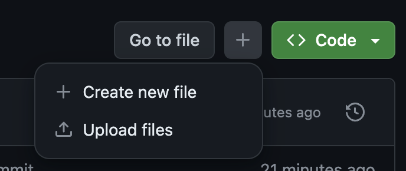
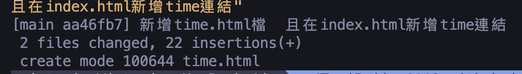

# github pages教學
1. 第一步是先去github新增一個專案 

   

2. (Repository name)欄位輸入自己github名字+.github.io

3. (Description (optional))欄位內容可以自訂,主要是你使用這專案要拿來做什麼的目的

4. (Public)勾選Public是公開讓大家看到你這份專案內容

5. 我在下方照片後另外拉出來解釋

   

6. (Add a README file)勾選後會在按下建立專案按鈕後,在專案頁面的下方顯示剛在(Repository name)跟(Description (optional))欄位填寫的內容,方便自己清楚這專案在做什麼

    

7. 第1-5步驟都好之後就可以按( Create repository)建立專案

     

8. 建立好的專案會長這樣建立好的專案會長這樣

    

9. 在(README)裡面會有一串網址是我們在(Repository name)欄位設定的,現在請複製這串網址,然後開啟瀏覽器直接把網址貼上去再按確定,就會看到你github用戶名跟網址及備註,有顯示出來就表示這串網址有設定正確.

    

10. 接下來請回去github.io專案,點擊右邊(Code)綠色按鈕旁邊的+紐,選擇第一個(Create new file),就會開啟一個撰寫程式碼的地方,就可以直接在github上新增檔案及撰寫內容了

    

11. (Name your file...)欄位寫上(index.html),下方撰寫程式碼可以先去Vscode寫完再貼過來,
在index檔裡新增一個標題為(我的作品集)新增完後按右邊的綠色按鈕(Commit changes...).
   

12. 按完綠色按鈕後會跳出視窗寫儲存的訊息,儲存的內容可以自訂,這邊內容我就寫(個人網誌測試),
(Commit directly to the main branch)意思是:將更改直接提交到主分支
(Create a **new branch** for this commit and start a pull request):開一個新分支儲存我寫的內容,
我們就選第一個就好,再按(commit changes)
    
    

13. 儲存完成後會看到github上新增一個index.html檔案,這時這時在複製(tsaipeijun1110.github.io)去瀏覽器貼上按搜尋,會直接出現我們在(index)打的內容,
這是因為github pages讀的是(tsaipeijun1110.github.io)這專案index檔為主要讀取檔,
所以即使你開別的名字檔案,github pages是不會讀到的  
    

14. 這是複製網址後貼上瀏覽器貼上瀏覽器搜尋後的結果  
        

15. 接下來來要把專案下載到桌面上,先開啟終端機,選擇要放到桌面還是文件裡,在回到githtb專案裡點(Code),複製裡面的網址,在終端機打上(git clone 網址)按執行,專案就成功下載到你指定的位置上了,在用VScode開啟專案
     

16. 

17. 

18. VScode開啟專案後的畫面
    

19. 這時新增一個檔案(time.html),內容用js寫一個顯示現在時間的功能
    

20. 回到index.html檔裡,新增一個連結導到time.html檔
    

21. 都新增完成後開啟終端機打上(git status),意思是列出你剛修改過哪些檔案
     

22. 接著在打上(git add .)意思是把剛新增的內容放到暫存區裡
    

23. 接著在打(git config user.email)這邊打上你建立github時的郵件
    

24. 接著在打(git config user.name)這邊打上你建立github時的名字
    

25. 接著在打(git coommit -m "新增time.html檔  且在index.html新增time")這連結邊打上要上傳到github時的註解
    

26. 接著在打(git push origin main)就可以把剛提交的內容上傳到github的
(TsaiPeijun1110.github.io)上了
    

27. 在回到(TsaiPeijun1110.github.io)的github裡重新整理畫面,就會看見我們剛新增的(time.html)檔,然後再複製(TsaiPeijun1110.github.io)去瀏覽器搜尋,就會有在index新增的
(time.html)連結
     

28. 點進去連結裡就有我們剛做的顯示現在時間功能
    
    這樣就完成基本的github pages 新增檔案及顯示在瀏覽器上的功能,接下來就可以上傳你做好的作品集上來了